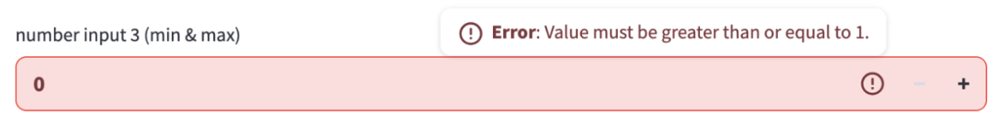

# Client-side and server-side input validation for `st.text_input`

## Summary

Add a `validate` parameter to `st.text_input` that supports client-side regex validation (string)
and server-side callable validation (function). When validation fails, the input is marked with an
error state and an error message is displayed, preventing the value from being submitted.

## Problem

Currently, validating user input in `st.text_input` requires triggering a full app or fragment rerun. This creates a poor user experience:

1. **Slow feedback**: Users must wait for a round-trip to the server before seeing validation errors
2. **Complex implementation**: Developers must manually track and display validation errors
3. **Unnecessary reruns**: Invalid inputs still trigger reruns even when they should be rejected

**Requests:**

- [#8790](https://github.com/streamlit/streamlit/issues/8790) - Support client-side validation via
  regex pattern for `st.text_input`
- [#1850](https://github.com/streamlit/streamlit/issues/1850) - Minimum characters for text_input
- [#6704](https://github.com/streamlit/streamlit/issues/6704) - Support more specialized types for
  `st.text_input` (email, url, phone)

**Use cases:**

- Email validation before form submission
- Phone number format validation
- Required minimum character length
- Custom patterns (e.g., `st.text_input("Widget", validate="^st\.[a-z_]+$")`)
- Complex server-side validation (e.g., checking if username is available)

**Consistency gap:**

`st.column_config.TextColumn` already supports client-side regex validation via its `validate`
parameter. This proposal brings the same capability to `st.text_input` while extending it with
server-side callable validation.

## Proposal

### API

```python
st.text_input(
    ...
    validate: str | tuple[str, str] | Callable[[str], bool | str] | None = None,  # NEW
)
```

### Parameters

| Parameter | Type | Default | Description |
|-----------|------|---------|-------------|
| `validate` | `str \| tuple[str, str] \| Callable[[str], bool \| str] \| None` | `None` | Validation rule for input. If string, treated as JS-flavored regex for client-side validation with a generic error message. If a tuple, treated as `(regex, error_message)` for client-side validation with a custom error message. If callable, executed server-side when value is submitted. If `None`, no validation is performed. |

### Behavior

The `validate` parameter supports two validation modes with different trade-offs:

| Mode | Syntax | Latency | Security | Use Cases |
|------|--------|---------|----------|-----------|
| **Client-side** | Regex string | Zero latency (runs in browser) | Can be bypassed | Format validation (email, phone), length constraints, pattern matching |
| **Server-side** | Callable | Network round-trip | Secure, tamper-proof | Database lookups (username availability), complex business logic, security-sensitive validation |

**Recommendation:** Use client-side regex for instant UX feedback on format constraints. Use server-side callables when validation requires backend resources or must be secure.

#### Client-side validation (regex string)

When `validate` is a string, it's treated as a JavaScript-flavored regular expression (same as with `st.column_config.TextColumn`):

```python
# Only accept valid email-like patterns
st.text_input("Email", validate=r"^[\w.+-]+@[\w-]+\.[\w.-]+$")

# Only accept Streamlit widget names
st.text_input("Widget", validate=r"^st\.[a-z_]+$")

# If provided, require at least 5 characters
st.text_input("Username", validate=r"^.{5,}$")

# Custom error message
st.text_input(
    "Email",
    validate=(r"^[\w.+-]+@[\w-]+\.[\w.-]+$", "Enter a valid email address."),
)
```

**Behavior:**

1. Regex is compiled on the frontend with fixed `us` flags to match existing
   `st.column_config.TextColumn` behavior. The `u` flag enables Unicode mode, and
   the `s` flag lets `.` match newlines. We intentionally don't use `m`, `g`, or
   `y`: validation patterns should match against the whole value, and stateful
   regex flags can produce inconsistent results across repeated validations.
2. Validation does not run on initial render. It runs when the user attempts to
   commit a value (blur/Enter) or submit a form; error state is cleared when user
   types in the input field.
3. If the input is the empty string, validation is skipped. Requiredness is handled
   separately by a future `required` parameter.
4. If input doesn't match the pattern:
   - Input turns red (error state) showing an error icon and a tooltip with the error message
   - Submit/Enter is blocked; value is not sent to backend
   - Similar to the error state update planned for number input:
  
5. If input matches the pattern:
   - Normal styling is restored
   - Value can be submitted, triggering a normal rerun and on_change callback execution if provided.

**Error messages:**

Client-side regex validation shows a generic error message by default. To provide a custom error
message, pass `validate=(regex, error_message)`:

```python
st.text_input(
    "Email",
    validate=(r"^[\w.+-]+@[\w-]+\.[\w.-]+$", "Enter a valid email address."),
)
```

The docstring should recommend custom error messages where possible because generic validation
messages are less helpful to users. Server-side validators can return `False` to show the generic
error message or return a string to show a custom error message.

> **Note:** We need to document that client-side validation can be bypassed by an "attacker". If the validation is security-relevant, it should be performed on the server-side.

#### Server-side validation (callable)

When `validate` is a callable, it's executed on the backend when the user submits the value
(pressing Enter or on blur). This uses a deferred execution pattern similar to
`st.download_button` with callable data.

```python
def check_username(value: str) -> bool | str:
    if len(value) < 3:
        return "Username must be at least 3 characters."
    if db.username_exists(value):
        return "Username already taken."
    return True

st.text_input("Username", validate=check_username)
```

> **Note:** if the validation callable returns anything other than bool or str, it's treated as an
> internal validation error. The widget uses the normal validation error UI with a generic error
> message; the exception message and full traceback are logged to the backend console for the
> developer. Developers are responsible for catching expected internal failures and returning
> user-friendly strings themselves.

**Callable signature:**

```python
def validator(value: str) -> bool | str:
    """
    Parameters
    ----------
    value : str
        The current input value to validate.

    Returns
    -------
    bool | str
        - True: Value is valid, allow submission
        - False: Value is invalid, show default error message
        - str: Value is invalid, show the returned string as error message
    """
```

**Behavior:**

1. User types in the input field (no validation yet; clears existing error state)
2. User submits (Enter key, blur, or form submit):
   - If the input is the empty string or `None` (e.g. an unset input or one cleared back to its
     `None` initial state), validation is skipped and the value is accepted. Requiredness is
     handled separately by a future `required` parameter.
   - The widget's normal blur/Enter commit is **deferred**: today `st.text_input` immediately
     pushes the new widget value to the backend and schedules a rerun on blur/Enter, but with a
     server-side validator this commit (and the rerun it would trigger) is held back until
     validation succeeds. Inside a form, the deferred commit happens on form submit instead of
     per-field blur/Enter (see the **Forms** edge case below).
   - Frontend sends a validation request to backend (no full rerun triggered)
   - Backend executes the callable with the current value
   - Backend returns validation result to frontend
3. Based on result:
   - `True`: Value is accepted. Outside a form, the deferred commit goes through and triggers the
     widget's normal rerun (and `on_change` callback if provided). Inside a form, the validated
     value is committed as part of the form submission and only the form's single submit rerun
     occurs (see the **Forms** edge case below).
   - `False` or error string: Input shows error state, no rerun, user can correct input (see mockup above for error state).
4. While validation is in progress:
   - Input shows a loading indicator (spinner icon)
   - Submit is disabled to prevent duplicate requests

**Deferred execution pattern:**

Server-side validation leverages the existing deferred execution infrastructure (used by
`st.download_button` with callable data). The callable is registered with a unique ID on the
backend, and the frontend can request its execution without triggering a full script rerun.

```
User submits → Frontend sends validation request → Backend executes callable
                                                         ↓
                                              Returns True/False/error string
                                                         ↓
Frontend receives result → Shows error OR triggers rerun with validated value
```

### Examples

**Basic email validation:**

```python
import streamlit as st

email = st.text_input(
    "Email address",
    validate=r"^[\w.+-]+@[\w-]+\.[\w.-]+$",
    placeholder="you@example.com"
)

if email:
    st.success(f"Email: {email}")
```

**Minimum character requirement:**

```python
import streamlit as st

# Require at least 8 characters for password
password = st.text_input(
    "Password",
    type="password",
    validate=r"^.{8,}$",
)
```

**Server-side username availability check:**

```python
import streamlit as st

def check_username(value: str) -> bool | str:
    if len(value) < 3:
        return "Username must be at least 3 characters."
    if value.lower() in ["admin", "root", "system"]:
        return "This username is reserved."
    # Simulate database check
    if value == "taken":
        return "Username already taken. Try another one."
    return True

username = st.text_input(
    "Choose a username",
    validate=check_username,
    placeholder="Enter a unique username"
)

if username:
    st.success(f"Username '{username}' is available!")
```

**Phone number with format hint:**

```python
import streamlit as st

phone = st.text_input(
    "Phone number",
    validate=r"^\+?[\d\s-]{10,}$",
    placeholder="+1 234 567 8900"
)
```

**Complex password validation (server-side):**

```python
import streamlit as st
import re

def validate_password(value: str) -> bool | str:
    if len(value) < 8:
        return "Password must be at least 8 characters."
    if not re.search(r"[A-Z]", value):
        return "Password must contain at least one uppercase letter."
    if not re.search(r"[a-z]", value):
        return "Password must contain at least one lowercase letter."
    if not re.search(r"\d", value):
        return "Password must contain at least one number."
    return True

password = st.text_input(
    "Create password",
    type="password",
    validate=validate_password
)
```

### Edge cases

- **None value**: If the text input is initialized with `value=None`, resetting to `None` (empty state) is allowed and bypasses validation.
- **Empty string**: Empty strings bypass validation. This keeps `validate` focused on validating
  provided values and avoids showing errors for optional empty fields. Requiredness should be
  handled by a future `required` parameter; for example, `required=True` combined with
  `validate=r"^.{5,}$"` would mean "must be present and at least 5 characters."
- **Invalid regex**: Since the pattern is JavaScript-flavored and compiled in the browser, invalid
  regexes are detected on the frontend after render rather than raised as normal Python exceptions
  during script execution. If the regex pattern is invalid, a visible error is surfaced in the
  input (consistent with `st.column_config.TextColumn`, which displays an "Invalid validate regex"
  error) and the issue is logged to the browser console/frontend log. The MVP does not report
  invalid regex diagnostics back to the backend. Validation is not silently skipped, so developers
  are notified of the broken pattern instead of unintentionally accepting unvalidated input.
- **Callable exception**: If the callable raises an exception, the value is rejected and the widget
  uses the normal validation error UI with a generic error message. The exception message and
  traceback are not sent to the frontend; the exception with the full traceback is logged to the
  backend console. Developers should catch expected validation errors and return user-friendly
  strings.
- **Slow callable**: Loading state is shown while waiting for server response. A 10-second timeout
  is enforced, after which validation fails with a timeout error.
- **Concurrent validation**: If user modifies input while server-side validation is in progress,
  the pending validation is cancelled and a new one is triggered on the next submit.
- **Forms**: Inside an `st.form`, validation is triggered by the form's submit button rather than
  by per-field blur/Enter, matching how form widgets defer their commits until submit. On submit,
  client-side regex checks run first, then any server-side callables; validation must pass for
  every field before the form is submitted. If any field is invalid, form submission is blocked,
  the offending fields show their error state, and no rerun occurs. When all fields are valid, the
  form submits with a single rerun—server-side validation does not trigger an extra per-field
  rerun inside forms.

### Future extensions

This validation pattern can be extended to other input widgets:

- `st.text_area`: Same API as `st.text_input`
- `st.column_config.TextColumn`: Server-side callable validation as a follow-up. It already
  supports client-side regex validation.
- `st.number_input`: Callable validation for custom numeric constraints
- `st.date_input`: Callable validation for date range/availability checks
- `st.selectbox`: Callable validation for conditional options
- `st.chat_input`: Regex validation for chat message format. Note that `st.chat_input` is a
  trigger widget (its value only exists during the rerun triggered by submission), so the
  validation interaction model would differ from the stateful widgets above and needs separate
  design consideration.

## Checklist

| Item                         | ✅ or comment          |
|------------------------------|------------------------|
| Works on SiS, Cloud, etc?    | ✅                      |
| No breaking API changes      | ✅                      |
| No new dependencies          | ✅                      |
| Metrics collected            | ✅                      |
| Any security/legal impact?   | Client-side regex validation can be bypassed; document that security-sensitive validation should use server-side callables |
| Any docs changes needed?     | Yes, document the new `validate` parameter for `st.text_input` |
