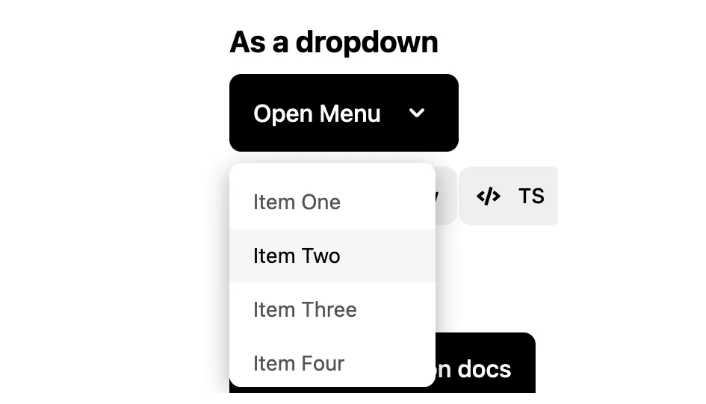

# Dropdown menu button widget

## Summary

Add a new `st.menu_button` widget that displays a button which, when clicked, opens a
dropdown menu with multiple options. Selecting an option triggers a rerun and returns the
selected option label. Unlike `st.selectbox`, this is a trigger (like `st.button`), not a
persistent selection—the button label remains unchanged after selection.



## Problem

Users need a way to offer multiple actions from a single button without cluttering the UI
with multiple buttons. A dropdown button (also known as a menu button or split button) is
a common UI pattern for this use case.

**Requests:**

- [#11409](https://github.com/streamlit/streamlit/issues/11409) — Add a menu/dropdown button
  widget (5+ upvotes)

**Use cases:**

- Action menus with multiple options (e.g., "Export as CSV", "Export as JSON", "Export as PDF")
- Compact UI for related actions that don't warrant separate buttons
- "More actions" overflow menus

**Comparison with `st.selectbox`:**

| Aspect         | `st.selectbox`             | `st.menu_button`           |
| -------------- | -------------------------- | -------------------------- |
| Purpose        | Persistent selection       | Trigger action             |
| Return value   | Currently selected option  | Clicked option (or `None`) |
| Button label   | Changes to selected option | Remains constant           |
| Rerun behavior | Reruns on selection change | Reruns on every click      |

## Proposal

### API

```python
st.menu_button(
    label: str,
    options: Sequence[T],
    *,
    key: Key | None = None,
    help: str | None = None,
    on_click: WidgetCallback | None = None,
    args: WidgetArgs | None = None,
    kwargs: WidgetKwargs | None = None,
    type: Literal["primary", "secondary", "tertiary"] = "secondary",
    icon: str | None = None,
    disabled: bool = False,
    width: Literal["content", "stretch"] | int = "content",
    format_func: Callable[[T], str] = str,
) -> T | None
```

> **Alternative names:** `st.dropdown_button`, `st.dropdown_menu`

### Parameters

A combination of `st.button` and `st.selectbox` parameters with the same semantics.

| Parameter     | Type                                          | Default       | Description                                                                                                  |
| ------------- | --------------------------------------------- | ------------- | ------------------------------------------------------------------------------------------------------------ |
| `label`       | `str`                                         | required      | Button label. Supports markdown.                                                                             |
| `options`     | `Sequence[T]`                                 | required      | List of options to display in the dropdown menu.                                                             |
| `key`         | `str \| int \| None`                          | `None`        | Unique key for the widget.                                                                                   |
| `help`        | `str \| None`                                 | `None`        | Tooltip text shown on hover.                                                                                 |
| `on_click`    | `Callable \| None`                            | `None`        | Callback function executed when an option is clicked.                                                        |
| `args`        | `list \| tuple \| None`                       | `None`        | Arguments to pass to the callback.                                                                           |
| `kwargs`      | `dict \| None`                                | `None`        | Keyword arguments to pass to the callback.                                                                   |
| `type`        | `Literal["primary", "secondary", "tertiary"]` | `"secondary"` | Button styling.                                                                                              |
| `icon`        | `str \| None`                                 | `None`        | Icon to display next to the button label (e.g., `:material/menu:`).                                          |
| `disabled`    | `bool`                                        | `False`       | Whether the button is disabled.                                                                              |
| `width`       | `Literal["content", "stretch"] \| int`        | `"content"`   | Button width. `"content"`: fit to content. `"stretch"`: expand to container width. `int`: fixed pixel width. |
| `format_func` | `Callable[[T], str]`                          | `str`         | Function to convert options to display strings. Supports markdown. Same behavior as in `st.selectbox`.       |

### Return Value

| Condition      | Return Value                                                        |
| -------------- | ------------------------------------------------------------------- |
| Option clicked | `T` — the clicked option value. Same behavior as in `st.selectbox`. |
| No click       | `None`                                                              |

### Behavior

- The button displays a chevron icon on the right side (same as `st.popover`) to indicate it opens a menu
- Clicking the button opens a dropdown menu displaying all options
- Selecting an option closes the menu, triggers a rerun, and returns the selected option value
- The button label remains unchanged after selection (unlike selectbox)
- Clicking outside the menu closes it without triggering a rerun
- If `on_click` is provided, the callback is executed with the selected option accessible
  via `st.session_state[key]` or the return value
- No keyboard shortcut support in initial implementation (consistent with `st.popover`)

### Examples

**Basic usage:**

```python
import streamlit as st

action = st.menu_button("Export", options=["CSV", "JSON", "PDF"])
if action == "CSV":
    export_csv()
elif action == "JSON":
    export_json()
elif action == "PDF":
    export_pdf()
```

**With format_func:**

```python
import streamlit as st

options = [{"id": 1, "name": "Edit"}, {"id": 2, "name": "Delete"}]
action = st.menu_button(
    "Actions",
    options=options,
    format_func=lambda x: f":material/edit: {x['name']}" if x["id"] == 1 else f":material/delete: {x['name']}",
)
if action:
    st.write(f"Selected ID: {action['id']}")
```

**Options with icons:**

```python
import streamlit as st

action = st.menu_button(
    "File",
    options=[
        ":material/file_open: Open",
        ":material/save: Save",
        ":material/delete: Delete",
    ],
)
```

### Edge Cases

- **Empty options**: Raises `StreamlitAPIException`
- **Duplicate options**: Allowed; returns the exact option value clicked
- **Long option labels**: Truncated with ellipsis; full text shown on hover
- **Many options**: Dropdown becomes scrollable beyond a threshold

## Checklist

| Item                       | ✅ or comment          |
| -------------------------- | ---------------------- |
| Works on SiS, Cloud, etc?  | ✅                     |
| No breaking API changes    | ✅                     |
| No new dependencies        | ✅                     |
| Metrics collected          | ✅                     |
| Any security/legal impact? | ✅                     |
| Any docs changes needed?   | ✅ Document new widget |
