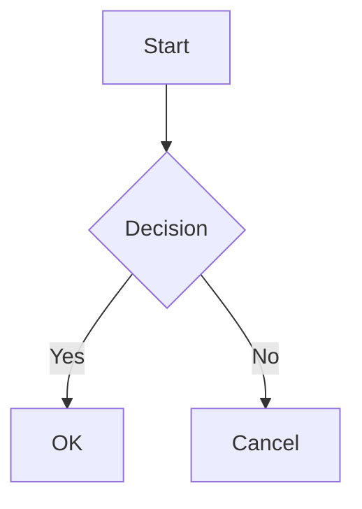
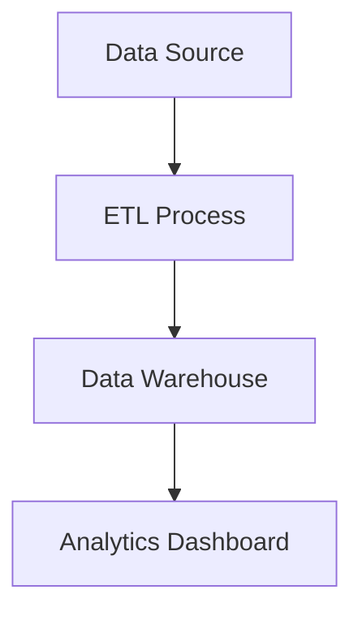

# Mermaid Chart Support

## Summary

Add native support for rendering [Mermaid](https://mermaid.js.org/) diagrams in Streamlit apps
through markdown code blocks and a dedicated `st.mermaid_chart` command. This enables users to
create flowcharts, sequence diagrams, class diagrams, and other visualizations using Mermaid's
text-based syntax.

## Problem

### User Requests

- [GitHub Issue #10721](https://github.com/streamlit/streamlit/issues/10721) — Mermaid diagram
  support

### Pain Points

Some Streamlit users need to visualize:

- System architectures and data flows
- Process workflows and decision trees
- Entity relationships
- Project timelines and Gantt charts
- State machines and sequence diagrams

Currently, users must either:

1. Use external tools (Lucidchart, Draw.io) to generate images and embed them with `st.image`
2. Use `st.graphviz_chart`, which has a steeper learning curve and limited diagram types
3. Use custom components or iframes to embed Mermaid

Mermaid has become the de-facto standard for text-based diagramming in documentation
(GitHub, GitLab, Notion, Obsidian) and AI chat applications (ChatGPT, Claude, Gemini),
making it a natural fit for Streamlit's user base.

### Use Cases

1. **Data Pipeline Documentation** — Visualizing ETL workflows and data transformations
2. **API Documentation** — Sequence diagrams showing request/response flows
3. **Decision Trees** — Visualizing ML model decisions or business logic
4. **Project Planning** — Gantt charts for sprint planning or project timelines
5. **Architecture Diagrams** — System component relationships and dependencies
6. **State Machines** — Visualizing app states and transitions

## Proposal

### API

#### Markdown Code Blocks (Primary Interface)

Users can embed Mermaid diagrams directly in markdown using fenced code blocks. This works
in all markdown surfaces that support code blocks, including `st.markdown`, tooltips (via
`help` parameter), alerts (`st.success`, etc.), and chat message content. The only exceptions
are widget labels and other constrained label contexts where complex elements are already
restricted.

````python
import streamlit as st

st.markdown("""

""")
````

This follows the same pattern used by GitHub, GitLab, and other platforms, making it familiar
and portable.

#### Dedicated Command (Discovery Helper)

For discoverability and explicit usage, provide `st.mermaid_chart`:

```python
st.mermaid_chart(
    body: str,                               # Mermaid diagram definition
    *,
    width: "auto" | "stretch" | "content" | int = "auto",  # Layout width
) -> DeltaGenerator
```

**Parameters:**

| Parameter | Type | Description |
|-----------|------|-------------|
| `body` | `str` | The Mermaid diagram definition using Mermaid syntax |
| `width` | `"auto"`, `"stretch"`, `"content"`, or `int` | The width of the element (default: `"auto"`). See `st.markdown` for details. |

**Implementation Note:** `st.mermaid_chart` internally calls `st.markdown` with the diagram
wrapped in a code fence. The fence uses four backticks (````) to safely handle diagrams that
may contain triple backticks in node labels or comments. This ensures consistent behavior
between both approaches while avoiding parsing issues.

`````python
# These are functionally equivalent for basic usage:
st.mermaid_chart("graph TD; A-->B")

st.markdown("""
````mermaid
graph TD; A-->B
````
""")
`````

**Toolbar Scope:** When a mermaid code block appears within mixed `st.markdown` content (e.g.,
alongside headings or paragraphs), the toolbar actions (fullscreen, download, copy) apply only
to the rendered diagram, not the entire markdown element. The toolbar overlays the diagram
portion and operates on the diagram content independently.

### Behavior

#### Supported Diagram Types

All Mermaid diagram types are supported:

| Type | Example Syntax |
|------|----------------|
| Flowchart | `graph TD; A-->B` |
| Sequence Diagram | `sequenceDiagram; Alice->>Bob: Hello` |
| Class Diagram | `classDiagram; Animal <\|-- Duck` |
| State Diagram | `stateDiagram-v2; [*] --> State1` |
| Entity Relationship | `erDiagram; CUSTOMER \|\|--o{ ORDER : places` |
| Gantt Chart | `gantt; Task: done, 2024-01-01, 7d` |
| Pie Chart | `pie; "Dogs": 386; "Cats": 325` |
| User Journey | `journey; section Go to work; Make tea: 5: Me` |
| Git Graph | `gitGraph; commit; branch develop; commit` |
| Mindmap | `mindmap; root((mindmap)); Origins` |
| Timeline | `timeline; 2020: Event 1; 2021: Event 2` |
| Quadrant Chart | `quadrantChart; Campaign A: [0.3, 0.6]` |
| Sankey Diagram | `sankey-beta; Source,Target,Value` |

#### Theming

Diagrams automatically match the Streamlit theme:

- **Colors**: Uses Streamlit's color palette (blue, green, orange, red, violet, yellow, gray)
- **Typography**: Matches Streamlit's font family and sizes
- **Dark/Light Mode**: Automatically adapts when users toggle themes

The theming uses Mermaid's "base" theme with Streamlit-specific color overrides:

- Primary elements use Streamlit blue
- Secondary elements use Streamlit green
- Tertiary elements use Streamlit orange
- Error states use Streamlit red
- Notes use Streamlit yellow
- Gantt chart completion uses Streamlit green
- Git graph branches use the full Streamlit color palette

#### Loading State

While the diagram is rendering:

- Shows a skeleton loader matching the element skeleton style
- Diagram area reserves space to prevent layout shift
- ARIA labels indicate loading state for screen readers

#### Error Handling

Invalid Mermaid syntax displays:

- A styled error message with the Mermaid parser error
- Error styled with Streamlit's error colors (red background)
- The original source is not exposed in the error

#### Streaming Behavior

When mermaid code blocks appear in streamed content (e.g., `st.write_stream`):

- **During streaming**: Mermaid code blocks render as syntax-highlighted code, showing the
  diagram source as it's being typed. This provides visual feedback and avoids flickering
  from failed partial diagram renders.
- **After streaming completes**: The code block transforms into a rendered mermaid diagram.

This "code-first, then diagram" approach ensures users see meaningful content during streaming
rather than error states or jarring partial renders. The implementation leverages the existing
`unterminatedParsing` flag that `StreamlitMarkdown` uses during streaming.

### Toolbar Actions

The rendered diagram includes a hover toolbar (consistent with other Streamlit charts):

| Action | Icon | Description |
|--------|------|-------------|
| Fullscreen | Expand icon | Opens diagram in fullscreen mode for complex diagrams |
| Download PNG | Download icon | Exports the diagram as a 2x-scaled PNG image |
| Copy Source | Copy icon | Copies the Mermaid source code to clipboard |

The toolbar appears on hover over the diagram container and follows Streamlit's toolbar styling.

### Examples

#### Basic Flowchart

```python
import streamlit as st

st.mermaid_chart('''
graph LR
    A[Start] --> B{Decision}
    B -->|Yes| C[OK]
    B -->|No| D[Cancel]
''')
```

#### Sequence Diagram

```python
import streamlit as st

st.mermaid_chart('''
sequenceDiagram
    participant User
    participant App
    participant Server
    User->>App: Click button
    App->>Server: API request
    Server-->>App: Response
    App-->>User: Update UI
''')
```

#### Gantt Chart

```python
import streamlit as st

st.mermaid_chart('''
gantt
    title Project Schedule
    dateFormat YYYY-MM-DD
    section Planning
    Research       :a1, 2024-01-01, 7d
    Design         :a2, after a1, 5d
    section Development
    Implementation :b1, after a2, 14d
    Testing        :b2, after b1, 7d
''')
```

#### Within Markdown Context

````python
import streamlit as st

st.markdown("""
## System Architecture

The following diagram shows our data pipeline:



The pipeline runs daily at midnight.
""")
````

### Security

Diagrams are rendered with security in mind:

- **Mermaid Security Level**: Uses `securityLevel: "strict"` to prevent XSS
- **SVG Sandboxing**: Rendered SVGs are loaded via blob URLs in `` tags, providing
  browser-enforced sandboxing (no script execution possible)

Note: `securityLevel: "strict"` already disables HTML labels and strips `foreignObject`
elements, so no additional `htmlLabels: false` configuration is needed. This allows
Mermaid to render richer label styling where supported while maintaining security.

**CSP Requirements**: The blob URL approach requires `blob:` in the `img-src` CSP directive.
Deployments with restrictive Content-Security-Policy headers must include:

```
img-src 'self' blob:;
```

Streamlit does not enforce a CSP by default, but enterprise deployments, reverse proxies,
or embedded iframe contexts may. Implementation should verify compatibility with common
strict-CSP configurations.

### Accessibility

- Diagrams include semantic alt text based on diagram type (e.g., "Mermaid flowchart")
- Users can provide richer accessibility via Mermaid's native `accTitle` and `accDescr`
  directives:

  ```mermaid
  accTitle: User authentication flow
  accDescr: Shows login flow from button click through OAuth to token validation
  graph TD
      A[Login] --> B[OAuth] --> C[Validate]
  ```

- **Implementation note**: Since SVGs are loaded via `` tags for security sandboxing,
  screen readers cannot access inner SVG elements. The implementation must extract
  `accTitle`/`accDescr` from the mermaid source and apply them as the ``
  attribute. If neither directive is present, fall back to generic alt text based on
  diagram type.
- Loading state uses `aria-busy="true"` and descriptive `aria-label`
- Error messages use `role="alert"` for screen reader announcements
- Fullscreen button has proper labeling

## Tradeoffs

- **Wheel size increase**: Adding mermaid.js increases the Streamlit Python wheel size (on disk)
  by ~7% due to bundled frontend assets. This is a one-time cost that affects all users,
  regardless of whether they use Mermaid diagrams. However, mermaid.js is lazy-loaded in the
  browser, so the initial JavaScript bundle loaded on app startup remains unchanged until a
  Mermaid diagram is actually rendered.

## Backwards Compatibility

### Markdown Fence Behavior Change

Today, `st.markdown("```mermaid\n...\n```")` renders as a plain fenced code block showing
the Mermaid source. After this change, it will render as a diagram instead.

**Decision:** This is an intentional behavior change that aligns Streamlit with GitHub, GitLab,
Notion, Obsidian, and other platforms where mermaid fences render automatically. This
consistency is a feature, not a bug — users can copy markdown between platforms without
modification.

**Escape hatch for displaying Mermaid source:** Users who want to display Mermaid syntax
as code (tutorials, documentation viewers, AI transcript tools) should use:

```python
st.code(mermaid_source, language="mermaid")
```

This provides syntax highlighting while explicitly preventing rendering.

**Impact assessment:** Apps intentionally displaying Mermaid source as code are rare edge
cases. The vast majority of users who include mermaid fences in markdown expect them to
render (matching GitHub behavior). The migration path (`st.markdown` → `st.code`) is
straightforward and well-documented.

## Out of Scope (Future Work)

The following are explicitly not included in this initial release:

- **`key` parameter** — Not needed for display-only elements without state
- **`height` parameter** — Diagrams auto-size vertically; users can wrap in `st.container`
- **Click interactions** — Mermaid supports click callbacks, but this requires additional
  API design for callback handling
- **Custom themes** — Users cannot override the automatic Streamlit theming
- **Server-side rendering** — Diagrams are rendered client-side only

## Alternatives Considered

**Option 1: Markdown-only (no dedicated command)**

- Pros: Zero new API surface, follows GitHub/GitLab pattern exactly
- Cons: Poor discoverability, users must know the syntax exists, no IDE autocomplete

**Option 2: Dedicated command only (no markdown support)**

- Pros: Clear API, easy to discover, metrics tracking straightforward
- Cons: Breaks portability with GitHub/GitLab markdown, forces users to learn new syntax

**Option 3: Both markdown and dedicated command** (CHOSEN)

- Pros: Best of both worlds — discoverability via `st.mermaid_chart`, portability via markdown
- Cons: Two ways to do the same thing, but the tradeoff is acceptable given the different
  use cases (quick exploration vs. copy-paste from documentation)

The markdown approach is designated as "primary" because it aligns with industry standards and
enables content portability. The dedicated command serves as a discovery helper for users who
may not know about the markdown syntax.

## Checklist

| Item                         | ✅ or comment |
|------------------------------|---------------|
| Works on SiS, Cloud, etc?    | ✅ Client-side rendering, no server dependencies |
| No breaking API changes      | ⚠️ Markdown mermaid fences now render instead of showing source (see Backwards Compatibility) |
| No new dependencies          | ✅ No new backend (Python) dependencies. mermaid.js is a new frontend dependency (lazy-loaded) |
| Metrics collected            | ✅ `st.mermaid_chart` tracked via `gather_metrics`. Markdown-based usage tracked via frontend telemetry when mermaid code blocks are rendered |
| Any security/legal impact?   | ✅ No — mermaid.js is MIT licensed; strict security mode used |
| Any docs changes needed?     | ✅ API reference docs and tutorial page |
